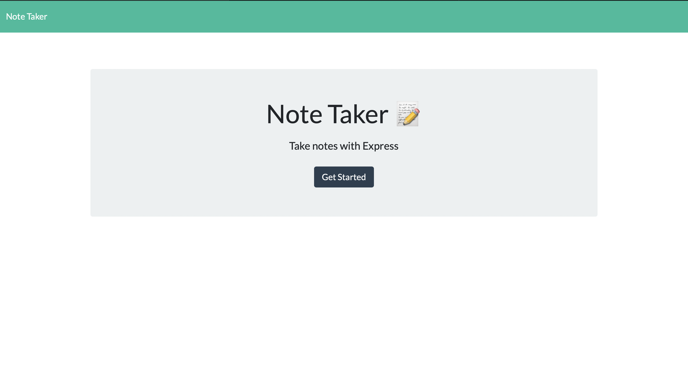
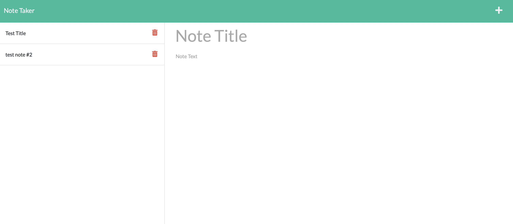

# Note-Taker

## Breakdown of code files

### db
    db.json
        This holds all the data from the note taker app, will be updated with add and remove functions

### lib
    This holds the functions for the routes

### public
    assets: This holds the public file
        cs
        js

### routes
    API routes
    HTML routes

### server.js
    This will run the server

Screenshots

